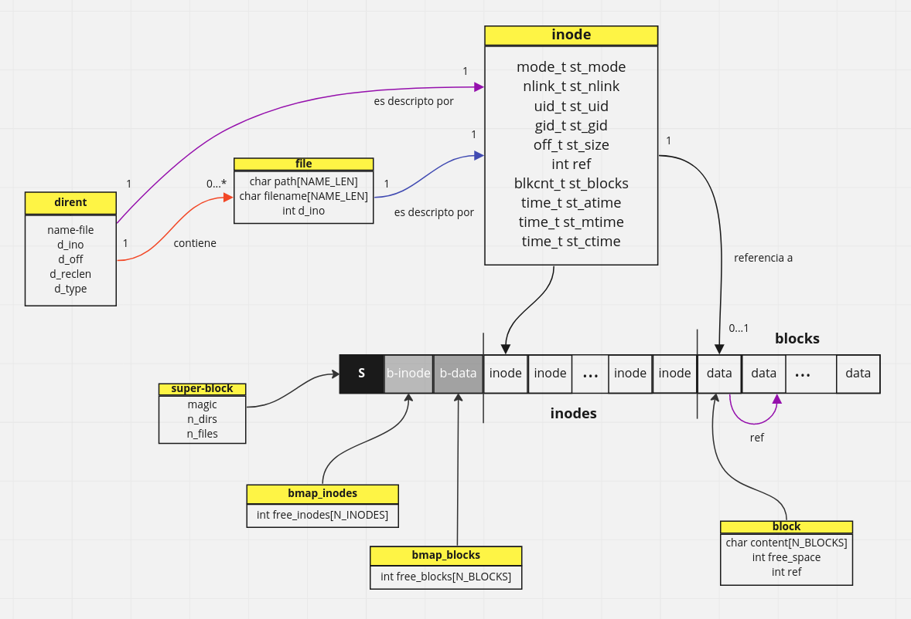

# FISOPFS: Sistema de archivos tipo FUSE.

Este proyecto es una implementación sobre el [trabajo práctico nº3](https://fisop.github.io/website/tps/filesystem/) de la materia Sistemas Operativos de FIUBA.

Filesystem in Userspace (FUSE) es una interfaz de software para sistemas operativos Unix-like que permite a los usuarios sin privilegios crear sus propios sistemas de archivos sin editar el código del kernel. Esto se logra ejecutando el código del sistema de archivos en el espacio del usuario, mientras que el módulo FUSE proporciona solo un puente a las interfaces reales del kernel.

## Dependencias

    sudo apt update && sudo apt install pkg-config libfuse2 libfuse-dev
    
## Estructura

FISOPFS se basa sobre los conceptos de [vsfs](https://pages.cs.wisc.edu/~remzi/OSTEP/file-implementation.pdf) (very simple filesystem), publicados en el libro Operating Systems: Three Easy Pieces, de Remzi Arpaci-Dusseau.

&nbsp;

&nbsp;

### Bloques

El programa almacena un total de 256 bloques de 256 bytes de espacio cada uno, resultando en una capacidad total de 65536 bytes para datos de archivos. Adicionalmente, cada bloque guarda en sí mismo cúanto espacio libre le queda, y, opcionalmente, una referencia hacia el siguiente bloque de datos correspondiente al mismo archivo.

### Inodos

Los inodos son la parte fundamental de el sistema de archivos. En ellos se almacena la metadata correspondiente a un archivo o directorio, manteniendo una relación 1 a 1 entre ellos. En el caso de que el inodo describa a un archivo, este guarda una referencia al primer bloque de datos correspondiente a este.

Si bien puede expandirse fácilmente (ya que está definido a partir de una constante), el sistema de archivos soporta un total de 64 inodos (un ratio de 1:4 entre inodos:bloques) , lo que resulta en un tamaño de archivos promedio de 1024 bytes. La cantidad máxima de bloques por inodo está definida como 16, por lo tanto, el tamaño máximo por archivo termina siendo 4096 bytes.

### Bitmaps

El sistema de archivos al momento de alocar nuevos bloques o inodos usa estructuras auxiliares llamadas bitmaps que funcionan como una freelist. Esto significa que esta estructura guarda en un vector de enteros el estado actual ( 0 = free, 1 = occupied ) correspondiente a un índice especfíco en la tabla real de inodos y bloques.

### Superbloque

Aquí se guarda información particular del filesystem, como lo es el número de archivos, directorios, y bloques alocados por el mismo. Adicionalmente se cuenta con un atributo mágico igualado a una constante, con la cual de verifica la correcta inicialización del filesystem. Como se detallará más adelante, cabe aclarar que el superbloque es el primer conjunto de datos que se carga a memoria, por lo cual, en caso de que este atributo no esté a lineado a su correcto valor, se podría asumir que los datos no pueden ser inicializados correctamente.

Toda la información usada por el filesystem, entonces, se encuentra en memoria, y puede encontrarse en las siguientes variables globales en las cuales gira entorno el sistema.

```
struct superblock *sb;
struct bmap_inodes *bitmap_inodes;
struct bmap_blocks *bitmap_blocks;
struct inode *inodes;
struct block *blocks;
struct file *files;
struct dirent *dirs;
```
## Operaciones soportadas por FISOPFS

####        Creación de archivos (touch, redirección de escritura)

```
manu@manu:~/Desktop/sisop_2022b_g23/fisopfs/mount$ touch asd.txt
manu@manu:~/Desktop/sisop_2022b_g23/fisopfs/mount$ echo "hola" > abc.txt
manu@manu:~/Desktop/sisop_2022b_g23/fisopfs/mount$ ls
abc.txt  asd.txt
```

####        Creación de directorios (con mkdir)

```
manu@manu:~/Desktop/sisop_2022b_g23/fisopfs/mount$ mkdir dir
manu@manu:~/Desktop/sisop_2022b_g23/fisopfs/mount$ ls
abc.txt  asd.txt  dir
```

####        Lectura de archivos (con cat, more, less, etc)

```
manu@manu:~/Desktop/sisop_2022b_g23/fisopfs/mount$ cat abc.txt
hola
```

####        Escritura de archivos (sobre-escritura y append con redirecciones)
```
manu@manu:~/Desktop/sisop_2022b_g23/fisopfs/mount$ echo "mundo" >> abc.txt
manu@manu:~/Desktop/sisop_2022b_g23/fisopfs/mount$ cat abc.txt
hola
mundo
manu@manu:~/Desktop/sisop_2022b_g23/fisopfs/mount$ echo "chau" > abc.txt
manu@manu:~/Desktop/sisop_2022b_g23/fisopfs/mount$ cat abc.txt
chau
```
####        Borrado de un archivo (con rm o unlink)

```
manu@manu:~/Desktop/sisop_2022b_g23/fisopfs/mount$ ls
abc.txt  asd.txt  dir
manu@manu:~/Desktop/sisop_2022b_g23/fisopfs/mount$ rm abc.txt
manu@manu:~/Desktop/sisop_2022b_g23/fisopfs/mount$ ls
asd.txt  dir
```

####        Borrado de un directorio (con rmdir)
```
manu@manu:~/Desktop/sisop_2022b_g23/fisopfs/mount$ rmdir dir
manu@manu:~/Desktop/sisop_2022b_g23/fisopfs/mount$ ls
asd.txt
```

---

## Desafíos

### Múltiples subdirectorios anidados

Se pide soportar: 

* Más de dos niveles de directorios.
* Se debe implementar una cota máxima a los niveles de directorios y a la longitud del path.

Esto se resuelve guardando el atributo **parent** dentro de cada directorio, que hace referencia al índice correspondiente a su directorio padre en el vector de directorios. En el caso del directorio root, este no tiene padre, por lo que su valor es -1.

La longitud del path está acotada por la constante FS_FILENAME_LEN = 64, mientras que la cota máxima para niveles de directorios es igual a la constante MAX_DEPTH_DIR = 8. Por ende, si se exceden estos valores, esto es informado al momento de intentar crear un nuevo directorio, o bien un nuevo archivo (en relación a FS_FILENAME_LEN).

```
manu@manu:~/Desktop/sisop_2022b_g23/fisopfs/mount$ cd a
manu@manu:~/Desktop/sisop_2022b_g23/fisopfs/mount/a$ mkdir b
manu@manu:~/Desktop/sisop_2022b_g23/fisopfs/mount/a$ cd b
manu@manu:~/Desktop/sisop_2022b_g23/fisopfs/mount/a/b$ mkdir c
manu@manu:~/Desktop/sisop_2022b_g23/fisopfs/mount/a/b$ cd c
manu@manu:~/Desktop/sisop_2022b_g23/fisopfs/mount/a/b/c$ mkdir d
manu@manu:~/Desktop/sisop_2022b_g23/fisopfs/mount/a/b/c$ cd d
manu@manu:~/Desktop/sisop_2022b_g23/fisopfs/mount/a/b/c/d$ mkdir e
manu@manu:~/Desktop/sisop_2022b_g23/fisopfs/mount/a/b/c/d$ cd e
manu@manu:~/Desktop/sisop_2022b_g23/fisopfs/mount/a/b/c/d/e$ mkdir f
manu@manu:~/Desktop/sisop_2022b_g23/fisopfs/mount/a/b/c/d/e$ cd f
manu@manu:~/Desktop/sisop_2022b_g23/fisopfs/mount/a/b/c/d/e/f$ mkdir g
manu@manu:~/Desktop/sisop_2022b_g23/fisopfs/mount/a/b/c/d/e/f$ cd g
manu@manu:~/Desktop/sisop_2022b_g23/fisopfs/mount/a/b/c/d/e/f/g$ mkdir h

mkdir: cannot create directory ‘h’: Numerical result out of range

manu@manu:~/Desktop/sisop_2022b_g23/fisopfs/mount/a/b/c/d/e/f/g$ echo "hola mundo" > hola.txt
manu@manu:~/Desktop/sisop_2022b_g23/fisopfs/mount/a/b/c/d/e/f/g$ cat hola.txt
hola mundo

manu@manu:~/Desktop/sisop_2022b_g23/fisopfs/mount/a/b/c/d/e/f/g$ touch aaaaaaaaaaaaaaaaaaaaaaaaaaaaaaaaaaaaaaaaaaaaaaaaaaaaaaaaaaaaaaaaaaaaaaaaaaaaaaaaaaaaaaaaaaaaaaaaaaaaaaaaaaaaaaaaaaaaaaaaaaaaaaaaaaaaaaaaaaaa

touch: cannot touch 'aaaaaaaaaaaaaaaaaaaaaaaaaaaaaaaaaaaaaaaaaaaaaaaaaaaaaaaaaaaaaaaaaaaaaaaaaaaaaaaaaaaaaaaaaaaaaaaaaaaaaaaaaaaaaaaaaaaaaaaaaaaaaaaaaaaaaaaaaaaa': Numerical result out of range

```

### Permisos y ownership

El filesystem soporta el cambio de permisos y ownership respectivos a un archivo o directorio. Por ejemplo, si contamos con dos usuarios:

* manu
* test

y un grupo:

* grupo

Cuando recién creamos el archivo, podemos tanto escribir como leerlo, debido a que el uid es igual al usuario "manu", y los permisos respectivos al uid de lectura y escritura (4 + 2).

```
manu@manu:~/Desktop/sisop_2022b_g23/fisopfs/mount$ echo "hola mundo" > archivo
manu@manu:~/Desktop/sisop_2022b_g23/fisopfs/mount$ stat archivo
  File: archivo
  Size: 11        	Blocks: 1          IO Block: 4096   regular file
Device: 34h/52d	Inode: 4           Links: 1
Access: (0664/-rw-rw-r--)  Uid: ( 1000/    manu)   Gid: ( 1000/    manu)
Access: 2022-12-20 18:55:58.000000000 -0300
Modify: 2022-12-20 18:55:55.000000000 -0300
Change: 2022-12-20 18:55:55.000000000 -0300
 Birth: -
manu@manu:~/Desktop/sisop_2022b_g23/fisopfs/mount$ cat archivo
hola mundo
```

Ahora bien, si cambiamos el ownership del archivo con chown a {uid = test, gid = grupo} (cabe aclarar que manu no pertenece al grupo "grupo"), los permisos que tendremos son respectivos a "other", por ende, el modo es únicamente de lectura (4). Cuando tratamos de escribir nuevamente en el archivo, lógicamente no podemos hacerlo debido a que no tiene los permisos suficientes.

```
manu@manu:~/Desktop/sisop_2022b_g23/fisopfs/mount$ chown test:grupo archivo
manu@manu:~/Desktop/sisop_2022b_g23/fisopfs/mount$ stat archivo
  File: archivo
  Size: 11        	Blocks: 1          IO Block: 4096   regular file
Device: 34h/52d	Inode: 4           Links: 1
Access: (0664/-rw-rw-r--)  Uid: ( 1001/    test)   Gid: ( 1002/   grupo)
Access: 2022-12-20 18:56:27.000000000 -0300
Modify: 2022-12-20 18:55:55.000000000 -0300
Change: 2022-12-20 18:56:25.000000000 -0300
 Birth: -
manu@manu:~/Desktop/sisop_2022b_g23/fisopfs/mount$ echo "chau" >> archivo
bash: echo: write error: Permission denied
manu@manu:~/Desktop/sisop_2022b_g23/fisopfs/mount$ cat archivo
hola mundo
```

En el caso de los directorios, al momento de crearlos estos tienen los permisos de lectura, escritura, y ejecución. Cabe aclarar que no se tienen en cuenta los permisos de ejecución al momento de acceder a los directorios.

Si un directorio tiene permiso de escritura, entonces se le permite la creación y eliminación de directorios.
```
manu@manu:~/Desktop/sisop_2022b_g23/fisopfs/mount$ ls
archivo  dir
manu@manu:~/Desktop/sisop_2022b_g23/fisopfs/mount$ stat dir
  File: dir
  Size: 0         	Blocks: 0          IO Block: 4096   directory
Device: 34h/52d	Inode: 3           Links: 3
Access: (0751/drwxr-x--x)  Uid: ( 1000/    manu)   Gid: ( 1000/    manu)
Access: 2022-12-20 18:59:31.000000000 -0300
Modify: 2022-12-20 08:20:01.000000000 -0300
Change: 2022-12-20 18:59:11.000000000 -0300
 Birth: -
```
Si un directorio tiene permiso de escritura, entonces se le permite la creación y eliminación de directorios.
```
manu@manu:~/Desktop/sisop_2022b_g23/fisopfs/mount$ cd dir
manu@manu:~/Desktop/sisop_2022b_g23/fisopfs/mount/dir$ ls
abc.txt
manu@manu:~/Desktop/sisop_2022b_g23/fisopfs/mount/dir$ touch otro.archivo
manu@manu:~/Desktop/sisop_2022b_g23/fisopfs/mount/dir$ ls
abc.txt  otro.archivo
```
Por ende, si cambiamos el modo del directorio a, por ejemplo, solo lectura y ejecución, no deberíamos poder eliminar el archivo que acabamos de crear.
```
manu@manu:~/Desktop/sisop_2022b_g23/fisopfs/mount/dir$ cd ..
manu@manu:~/Desktop/sisop_2022b_g23/fisopfs/mount$ chmod 551 dir
manu@manu:~/Desktop/sisop_2022b_g23/fisopfs/mount$ cd dir
manu@manu:~/Desktop/sisop_2022b_g23/fisopfs/mount/dir$ rm otro.archivo
rm: cannot remove 'otro.archivo': Permission denied
manu@manu:~/Desktop/sisop_2022b_g23/fisopfs/mount/dir$ ls
abc.txt  otro.archivo
```
Por otro lado, si el directorio no cuenta con permisos de lectura, entonces no es posible leer los archivos que contiene:
```
manu@manu:~/Desktop/sisop_2022b_g23/fisopfs/mount/dir$ cd ..
manu@manu:~/Desktop/sisop_2022b_g23/fisopfs/mount$ chmod 151 dir
manu@manu:~/Desktop/sisop_2022b_g23/fisopfs/mount$ cd dir
manu@manu:~/Desktop/sisop_2022b_g23/fisopfs/mount/dir$ ls
ls: reading directory '.': Permission denied
```

